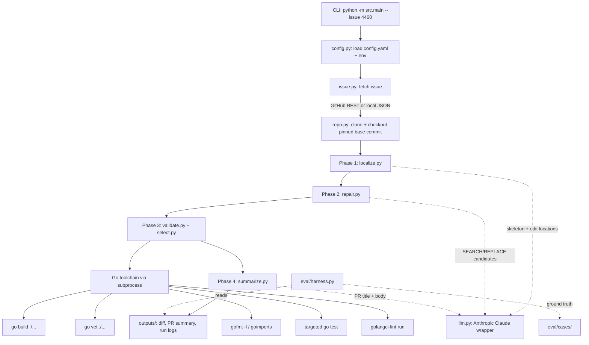
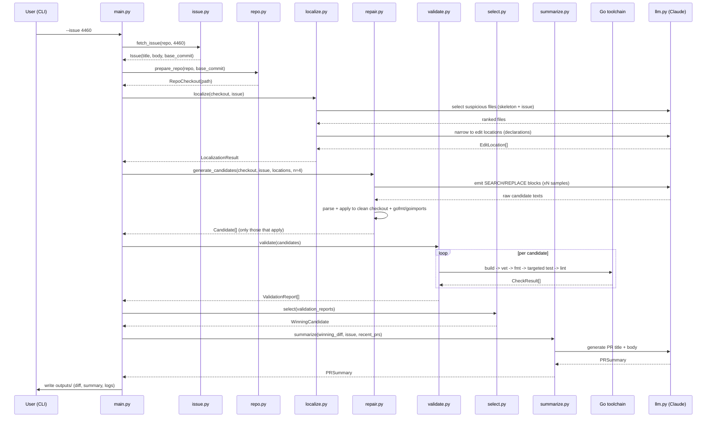
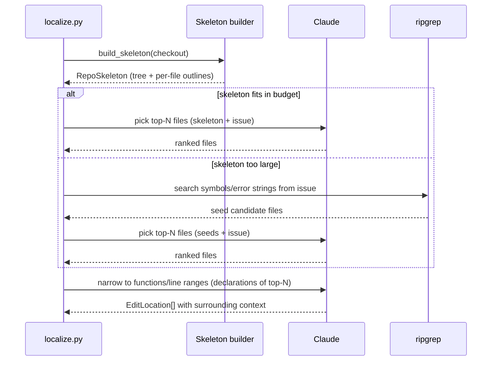

# Design Document: Agentless Go Contributor

## Overview

The Agentless Go Contributor is a deterministic, four-phase pipeline that turns a GitHub issue from an approved Go repository into a production-quality fix. Given an issue (fetched from the GitHub REST API or a local JSON fallback), the system localizes the relevant files, generates multiple candidate patches, validates and ranks them using the native Go toolchain, selects a winner, and writes a PR title and body. The deliverable is a local branch/diff plus a PR summary; opening a real PR is optional.

The design follows the **Agentless** philosophy. There is **no autonomous tool-calling loop, no planner that decides its own actions, and no multi-agent setup**. Instead, control flow is a fixed sequence of stages where each LLM call has a tightly scoped input and a single, well-defined responsibility. The Python orchestrator owns all control flow; the LLM is used only for the focused sub-tasks of file selection, edit-location narrowing, patch generation, and prose summarization. The native Go toolchain (`go build`, `go vet`, `gofmt`, `goimports`, `go test`, `golangci-lint`) is the source of truth for validation — nothing is fed back into an "agent" to re-plan. This intentional simplicity is what makes runs reproducible and reviewable.

The system is optimized for the five reviewer criteria: (1) right files identified, (2) relevant code changes, (3) project conventions followed, (4) appropriate validation run, (5) reasonable PR summary. An evaluation harness measures the first four against a known merged PR and produces a side-by-side diff comparison.

## Architecture



The pipeline is strictly linear. Each phase consumes the output of the previous phase and writes a traceable artifact to `outputs/`. No phase calls back into a prior phase; failures short-circuit with a clear error or a documented fallback.

## Sequence Diagrams

### Main end-to-end run



### Phase 1 hierarchical localization (with fallback)



## Components and Interfaces

### Component: config.py

**Purpose**: Load and validate `config.yaml` and environment variables into a typed config object.

**Interface**:
```python
@dataclass(frozen=True)
class LLMConfig:
    model: str
    temperature: float
    sample_count: int          # n candidates for repair
    max_retries: int
    request_timeout_s: int

@dataclass(frozen=True)
class Config:
    repo: str                  # e.g. "gin-gonic/gin"
    issue_number: int          # default example: 4460
    base_commit: Optional[str] # pinned base commit (parent of merged PR)
    top_n_files: int           # localization breadth
    llm: LLMConfig
    offline: bool              # use local JSON issue fallback
    workdir: Path
    outputs_dir: Path

def load_config(path: Path, overrides: dict) -> Config: ...
```

**Responsibilities**:
- Parse `config.yaml`; apply CLI overrides (e.g. `--issue`).
- Read `ANTHROPIC_API_KEY` from env (never from config file).
- Validate required fields and fail fast with actionable messages.

### Component: issue.py

**Purpose**: Fetch issue metadata and body from GitHub or a local JSON fallback.

**Interface**:
```python
@dataclass(frozen=True)
class Issue:
    repo: str
    number: int
    title: str
    body: str
    labels: list[str]
    base_commit: Optional[str]   # parent of merged PR when known
    merged_pr: Optional[MergedPRRef]  # ground-truth ref for eval, if present

def fetch_issue(repo: str, number: int, *, offline: bool, cache_dir: Path) -> Issue: ...
def load_issue_json(path: Path) -> Issue: ...
```

**Responsibilities**:
- GitHub REST ingestion via PyGithub/requests; cache responses to disk.
- Offline fallback reads a checked-in JSON file (full offline review).

### Component: repo.py

**Purpose**: Clone the target repo and check out a pinned base commit for reproducible validation.

**Interface**:
```python
@dataclass(frozen=True)
class RepoCheckout:
    repo: str
    path: Path
    base_commit: str

def prepare_repo(repo: str, base_commit: Optional[str], workdir: Path) -> RepoCheckout: ...
def clean_worktree(checkout: RepoCheckout) -> Path: ...   # fresh copy for a candidate
def make_diff(checkout_path: Path) -> str: ...            # unified diff vs base_commit
```

**Responsibilities**:
- Clone (or reuse cached clone) and `git checkout` the pinned base commit.
- Provide isolated clean worktrees so each candidate is applied independently.

### Component: llm.py

**Purpose**: Single wrapper for all Anthropic Claude calls with retry and JSON parsing.

**Interface**:
```python
@dataclass(frozen=True)
class LLMResponse:
    text: str
    raw: dict

def complete(prompt: str, *, cfg: LLMConfig, temperature: Optional[float] = None,
             n: int = 1) -> list[LLMResponse]: ...

def complete_json(prompt: str, *, cfg: LLMConfig, schema: dict) -> dict: ...
```

**Responsibilities**:
- Wrap all model calls; centralize retry/backoff and JSON-parse-with-repair.
- Support `n` samples for repair candidate generation.
- Log every prompt + response to `outputs/` for traceability.

### Component: patch.py

**Purpose**: Parse and apply SEARCH/REPLACE patch blocks.

**Interface**:
```python
@dataclass(frozen=True)
class SearchReplaceBlock:
    file_path: str
    search: str
    replace: str

@dataclass(frozen=True)
class ApplyResult:
    applied: bool
    reason: Optional[str]      # why it failed to apply, if applicable

def parse_blocks(llm_text: str) -> list[SearchReplaceBlock]: ...
def apply_blocks(worktree: Path, blocks: list[SearchReplaceBlock]) -> ApplyResult: ...
```

**Responsibilities**:
- Parse strict SEARCH/REPLACE format (chosen over unified diffs, which fail to apply).
- Apply exact-match search blocks; report clean failures rather than fuzzy-applying.

### Component: localize.py (Phase 1)

**Purpose**: Hierarchical localization producing ranked edit locations.

**Interface**:
```python
@dataclass(frozen=True)
class FileOutline:
    path: str
    package: str
    decls: list[str]           # exported funcs/types/methods with signatures

@dataclass(frozen=True)
class RepoSkeleton:
    tree: list[str]
    outlines: list[FileOutline]
    approx_tokens: int

@dataclass(frozen=True)
class EditLocation:
    file_path: str
    symbol: Optional[str]      # function/method/type name
    start_line: int
    end_line: int
    context: str               # surrounding code

@dataclass(frozen=True)
class LocalizationResult:
    ranked_files: list[str]
    locations: list[EditLocation]
    used_fallback: bool

def build_skeleton(checkout: RepoCheckout) -> RepoSkeleton: ...
def localize(checkout: RepoCheckout, issue: Issue, cfg: Config) -> LocalizationResult: ...
```

**Responsibilities**:
- Build a cheap repo skeleton (directory tree + per-file outlines via light Go-aware pass / `go doc` / grep — never dump whole files).
- LLM picks top-N suspicious files; LLM narrows to functions / line ranges.
- Fallback: ripgrep over symbols/error strings from the issue when skeleton exceeds budget.

### Component: repair.py (Phase 2)

**Purpose**: Generate and pre-filter candidate patches.

**Interface**:
```python
@dataclass(frozen=True)
class Candidate:
    id: str
    blocks: list[SearchReplaceBlock]
    worktree: Path
    diff: str                  # normalized unified diff vs base
    applied_clean: bool

def generate_candidates(checkout: RepoCheckout, issue: Issue,
                        locations: list[EditLocation], cfg: Config) -> list[Candidate]: ...
```

**Responsibilities**:
- Prompt the LLM to emit strict SEARCH/REPLACE blocks; sample `n` candidates at moderate temperature.
- Apply each to a clean worktree; run gofmt/goimports; discard non-applying candidates.

### Component: validate.py (Phase 3a)

**Purpose**: Run layered Go-toolchain checks per candidate.

**Interface**:
```python
class CheckName(str, Enum):
    REPRO_TEST = "repro_test"
    BUILD = "build"
    VET = "vet"
    FMT = "fmt"
    TEST = "test"
    LINT = "lint"

@dataclass(frozen=True)
class CheckResult:
    name: CheckName
    passed: bool
    skipped: bool
    output: str

@dataclass(frozen=True)
class ValidationReport:
    candidate_id: str
    checks: list[CheckResult]
    breaks_existing_tests: bool

def generate_repro_test(issue: Issue, checkout: RepoCheckout, cfg: Config) -> Optional[str]: ...
def validate(candidates: list[Candidate], repro_test: Optional[str],
             cfg: Config) -> list[ValidationReport]: ...
```

**Responsibilities**:
- Optionally generate a reproduction test from the issue.
- For each applying candidate run layered checks (build → vet → fmt → targeted test → lint). Record pass/fail; feed nothing back into an agent.

### Component: select.py (Phase 3b)

**Purpose**: Rank validation reports and pick a winner.

**Interface**:
```python
@dataclass(frozen=True)
class RankedCandidate:
    candidate: Candidate
    report: ValidationReport
    score: tuple             # lexicographic ranking key

def select(candidates: list[Candidate], reports: list[ValidationReport],
           cfg: Config) -> Optional[RankedCandidate]: ...
```

**Responsibilities**:
- Rank: passes repro test > passes existing tests > vet/build clean.
- Break ties with majority voting over normalized diffs.
- Drop any candidate that breaks existing tests. Return the single winner.

### Component: summarize.py (Phase 4)

**Purpose**: Generate PR title and body matching repo conventions.

**Interface**:
```python
@dataclass(frozen=True)
class PRSummary:
    title: str
    body: str

def fetch_recent_merged_prs(repo: str, k: int, *, offline: bool) -> list[str]: ...
def summarize(winning_diff: str, issue: Issue, recent_prs: list[str],
              cfg: Config) -> PRSummary: ...
```

**Responsibilities**:
- From winning diff + issue, generate PR title and body.
- Fetch 2–3 recent merged PRs to match style/structure.

### Component: eval/harness.py

**Purpose**: Measure pipeline quality against a known merged PR.

**Interface**:
```python
@dataclass(frozen=True)
class EvalCase:
    repo: str
    issue_number: int
    base_commit: str
    gold_changed_files: list[str]
    gold_diff: str

@dataclass(frozen=True)
class EvalReport:
    file_precision: float
    file_recall: float
    build_passed: bool
    vet_passed: bool
    tests_passed: bool
    diff_comparison: str       # side-by-side our diff vs gold diff

def run_eval(case: EvalCase, cfg: Config) -> EvalReport: ...
```

**Responsibilities**:
- Compute file-level localization precision/recall (our changed files vs PR's).
- Report whether build/vet/test pass; render side-by-side diff comparison.
- Drive 2–3 ground-truth cases stored under `eval/cases/`.

## Data Models

### Issue

```python
@dataclass(frozen=True)
class Issue:
    repo: str
    number: int
    title: str
    body: str
    labels: list[str]
    base_commit: Optional[str]
    merged_pr: Optional[MergedPRRef]
```

**Validation Rules**:
- `repo` matches `owner/name` and is in the approved repo allowlist.
- `number` is a positive integer.
- `title` is non-empty; `body` may be empty but must be a string.

### EditLocation

```python
@dataclass(frozen=True)
class EditLocation:
    file_path: str
    symbol: Optional[str]
    start_line: int
    end_line: int
    context: str
```

**Validation Rules**:
- `file_path` exists in the checked-out repo and ends in `.go`.
- `1 <= start_line <= end_line` within the file's line count.
- `context` is non-empty.

### Candidate

```python
@dataclass(frozen=True)
class Candidate:
    id: str
    blocks: list[SearchReplaceBlock]
    worktree: Path
    diff: str
    applied_clean: bool
```

**Validation Rules**:
- `blocks` is non-empty.
- If `applied_clean` is True, `diff` is a valid non-empty unified diff.
- Each block's `file_path` is one of the localized files (or an explicitly allowed new file).

### ValidationReport

```python
@dataclass(frozen=True)
class ValidationReport:
    candidate_id: str
    checks: list[CheckResult]
    breaks_existing_tests: bool
```

**Validation Rules**:
- `checks` contains at most one entry per `CheckName`.
- A check is either `passed` xor `skipped` (never both true).
- `breaks_existing_tests` is True iff the `TEST` check ran and failed on previously passing tests.

## Algorithmic Pseudocode

### Main pipeline orchestration

```python
def run_pipeline(cfg: Config) -> RunResult:
    # Precondition: cfg is valid; ANTHROPIC_API_KEY present unless every phase is cached.
    issue = fetch_issue(cfg.repo, cfg.issue_number, offline=cfg.offline, cache_dir=cfg.workdir)
    checkout = prepare_repo(cfg.repo, issue.base_commit, cfg.workdir)

    # Phase 1
    loc = localize(checkout, issue, cfg)
    log_artifact("localization", loc)

    # Phase 2
    candidates = generate_candidates(checkout, issue, loc.locations, cfg)
    applying = [c for c in candidates if c.applied_clean]
    log_artifact("candidates", candidates)
    if len(applying) == 0:
        return RunResult(status="no_applicable_patch", localization=loc)

    # Phase 3
    repro = generate_repro_test(issue, checkout, cfg)   # may be None
    reports = validate(applying, repro, cfg)
    winner = select(applying, reports, cfg)
    log_artifact("validation", reports)
    if winner is None:
        return RunResult(status="no_valid_patch", localization=loc, reports=reports)

    # Phase 4
    recent = fetch_recent_merged_prs(cfg.repo, k=3, offline=cfg.offline)
    summary = summarize(winner.candidate.diff, issue, recent, cfg)
    write_outputs(cfg.outputs_dir, winner, summary, reports, loc)

    return RunResult(status="success", winner=winner, summary=summary)
    # Postcondition: on success, outputs_dir contains a diff, PR summary, and per-phase logs.
```

**Preconditions:**
- `cfg` has passed `load_config` validation.
- Network available, or `cfg.offline` True with cached issue/PR JSON present.
- Go toolchain installed and on PATH.

**Postconditions:**
- Returns a `RunResult` with a terminal `status`.
- On `success`, `outputs_dir` holds the winning diff, PR summary, validation reports, and localization log.
- The base checkout is never mutated; all edits happen in isolated worktrees.

**Loop Invariants:** N/A at this level (loops live in sub-phases).

### Phase 1: hierarchical localization

```python
def localize(checkout: RepoCheckout, issue: Issue, cfg: Config) -> LocalizationResult:
    skeleton = build_skeleton(checkout)
    used_fallback = False

    if skeleton.approx_tokens <= SKELETON_TOKEN_BUDGET:
        ranked_files = llm_pick_files(skeleton, issue, cfg, top_n=cfg.top_n_files)
    else:
        seeds = ripgrep_seeds(checkout, extract_symbols_and_errors(issue))
        used_fallback = True
        ranked_files = llm_pick_files(restrict(skeleton, seeds), issue, cfg, top_n=cfg.top_n_files)

    locations = []
    for path in ranked_files:                      # invariant: only files from skeleton/seeds
        decls = declarations_of(checkout, path)
        narrowed = llm_narrow_locations(path, decls, issue, cfg)
        for n in narrowed:
            locations.append(with_context(checkout, n))

    # Postcondition: every location references an existing .go file with valid line range.
    return LocalizationResult(ranked_files=ranked_files, locations=locations,
                              used_fallback=used_fallback)
```

**Preconditions:**
- `checkout.path` is a valid clone at `base_commit`.
- `issue.title`/`issue.body` available for prompting.

**Postconditions:**
- `ranked_files` has length ≤ `cfg.top_n_files`, all existing `.go` paths.
- Each `EditLocation` has a valid line range and non-empty context.

**Loop Invariants:**
- Every `path` iterated is a member of `ranked_files` (which derive only from the skeleton or grep seeds — never hallucinated).
- All locations accumulated so far reference files that exist in the checkout.

### Phase 2: candidate generation and pre-filter

```python
def generate_candidates(checkout, issue, locations, cfg) -> list[Candidate]:
    raw_samples = llm_emit_patches(issue, locations, cfg,
                                   n=cfg.llm.sample_count, temperature=MODERATE_TEMP)
    candidates = []
    for i, sample in enumerate(raw_samples):
        blocks = parse_blocks(sample.text)
        if len(blocks) == 0:
            continue                               # malformed sample, skip
        worktree = clean_worktree(checkout)        # invariant: fresh, unmutated copy
        result = apply_blocks(worktree, blocks)
        if result.applied:
            run_gofmt_and_goimports(worktree)
            diff = normalized_diff(make_diff(worktree))
            candidates.append(Candidate(id=f"c{i}", blocks=blocks, worktree=worktree,
                                        diff=diff, applied_clean=True))
        else:
            candidates.append(Candidate(id=f"c{i}", blocks=blocks, worktree=worktree,
                                        diff="", applied_clean=False))
    # Postcondition: candidates marked applied_clean have a non-empty normalized diff.
    return candidates
```

**Preconditions:**
- `locations` non-empty (Phase 1 produced at least one edit location).
- `cfg.llm.sample_count >= 1`.

**Postconditions:**
- Returns one `Candidate` per non-malformed sample.
- Each `applied_clean` candidate has formatted code and a non-empty normalized diff.

**Loop Invariants:**
- Each iteration operates on a fresh worktree; no candidate observes another candidate's edits.
- The base checkout remains byte-identical to `base_commit` throughout.

### Phase 3: validation and selection

```python
def validate(candidates, repro_test, cfg) -> list[ValidationReport]:
    reports = []
    for c in candidates:                           # invariant: only applying candidates passed in
        checks = []
        if repro_test is not None:
            install_test(c.worktree, repro_test)
            checks.append(run_check(REPRO_TEST, c.worktree))

        layered = [BUILD, VET, FMT, TEST, LINT]
        for name in layered:                       # invariant: ordering preserved build->...->lint
            res = run_check(name, c.worktree)       # LINT skipped if golangci-lint absent
            checks.append(res)
            if name == BUILD and not res.passed:
                break                              # no point vetting/testing un-buildable code

        breaks = test_regressed(c.worktree, checks)
        reports.append(ValidationReport(c.id, checks, breaks_existing_tests=breaks))
    return reports


def select(candidates, reports, cfg) -> Optional[RankedCandidate]:
    eligible = [(c, r) for c, r in zip(candidates, reports) if not r.breaks_existing_tests]
    if len(eligible) == 0:
        return None
    ranked = sort_by(eligible, key=score_key, descending=True)   # lexicographic
    top_score = score_key(ranked[0])
    tied = [rc for rc in ranked if score_key(rc) == top_score]
    if len(tied) > 1:
        winner = majority_vote_over_diffs(tied)    # most common normalized diff
    else:
        winner = ranked[0]
    return as_ranked_candidate(winner)


def score_key(candidate_report) -> tuple:
    _, r = candidate_report
    return (passed(r, REPRO_TEST),     # highest priority
            passed(r, TEST),
            passed(r, VET) and passed(r, BUILD),
            passed(r, LINT),
            passed(r, FMT))
```

**Preconditions:**
- Every candidate passed to `validate` has `applied_clean == True`.
- Go toolchain available; `repro_test` is either valid Go test source or None.

**Postconditions:**
- `validate` returns exactly one `ValidationReport` per candidate.
- `select` returns None iff every candidate breaks existing tests; otherwise returns one winner with the maximal score key.

**Loop Invariants:**
- In `validate`, checks are appended in fixed layered order; a failed BUILD short-circuits remaining checks.
- In `select`, `eligible` never contains a candidate that breaks existing tests.

### Phase 4: PR summary

```python
def summarize(winning_diff, issue, recent_prs, cfg) -> PRSummary:
    # Precondition: winning_diff is a non-empty unified diff; recent_prs may be empty.
    style = derive_style(recent_prs)               # headings, prefix conventions, tone
    result = llm_write_pr(winning_diff, issue, style, cfg)
    title, body = parse_title_body(result)
    # Postcondition: title is a single non-empty line; body references the issue number.
    return PRSummary(title=title, body=body)
```

**Preconditions:**
- `winning_diff` non-empty.
- `issue.number` available for cross-referencing.

**Postconditions:**
- `title` is a single non-empty line; `body` references the issue and summarizes the change.

**Loop Invariants:** N/A.

## Key Functions with Formal Specifications

### apply_blocks()

```python
def apply_blocks(worktree: Path, blocks: list[SearchReplaceBlock]) -> ApplyResult
```

**Preconditions:**
- `worktree` is a writable clean copy of the base checkout.
- `blocks` is non-empty; each `search` is a literal substring to match.

**Postconditions:**
- Returns `applied=True` iff every block's `search` matched exactly once in its target file and was replaced.
- On any non-unique or zero match, returns `applied=False` with a `reason` and leaves the worktree unmodified (atomic apply).

**Loop Invariants:**
- Before applying block *k*, all blocks `0..k-1` have been applied successfully; if block *k* fails, all prior edits are rolled back so the worktree is unchanged.

### run_check()

```python
def run_check(name: CheckName, worktree: Path) -> CheckResult
```

**Preconditions:**
- `worktree` contains the candidate's applied edits.
- The corresponding Go tool is resolvable on PATH, or the check is marked skipped.

**Postconditions:**
- Returns `passed=True` iff the subprocess exits 0 (for FMT: `gofmt -l` lists no files).
- `skipped=True` iff the tool is unavailable (e.g. `golangci-lint`); `passed` is False when skipped.
- `output` captures combined stdout/stderr for traceability.

**Loop Invariants:** N/A (single subprocess invocation).

### build_skeleton()

```python
def build_skeleton(checkout: RepoCheckout) -> RepoSkeleton
```

**Preconditions:**
- `checkout.path` exists and contains Go source.

**Postconditions:**
- `tree` lists every directory and `.go` file under the repo root.
- Each `FileOutline` contains the package name and exported declarations only — no full file bodies.
- `approx_tokens` is a non-negative estimate used for the budget decision.

**Loop Invariants:**
- After processing file *i*, `outlines` holds one entry per `.go` file seen so far, each with package + exported decls.

## Example Usage

```python
# Example 1: One-command run on the default example issue
#   $ python -m src.main --issue 4460
cfg = load_config(Path("config.yaml"), overrides={"issue_number": 4460})
result = run_pipeline(cfg)
assert result.status in {"success", "no_applicable_patch", "no_valid_patch"}

# Example 2: Fully offline run for review (local issue JSON)
cfg = load_config(Path("config.yaml"), overrides={"issue_number": 4460, "offline": True})
result = run_pipeline(cfg)

# Example 3: Switch to another approved repo via config override
cfg = load_config(Path("config.yaml"),
                  overrides={"repo": "spf13/cobra", "issue_number": 1234})
result = run_pipeline(cfg)

# Example 4: Evaluation against a known merged PR
case = load_eval_case(Path("eval/cases/gin-4460.json"))
report = run_eval(case, cfg)
print(report.file_precision, report.file_recall, report.tests_passed)
print(report.diff_comparison)   # side-by-side our diff vs accepted PR diff
```

## Correctness Properties

These universally-quantified statements describe behavior the implementation must guarantee. They map directly to the five reviewer criteria and become the basis for property-based and example tests.

### Property 1: Base immutability

For all runs, the base checkout at `base_commit` is never mutated; every candidate edit occurs in an isolated worktree. (Reproducibility / fair comparison.)

### Property 2: Localization soundness

For all `EditLocation` produced by Phase 1, `file_path` exists in the checkout, ends in `.go`, and `1 <= start_line <= end_line <= file_line_count`. No hallucinated files. (Criterion 1: right files.)

### Property 3: Patch atomicity

For all candidates, `apply_blocks` either applies all blocks (worktree changed) or applies none (worktree unchanged); there is no partial application. (Criterion 2: relevant changes.)

### Property 4: Applied implies formatted

For all candidates with `applied_clean == True`, running `gofmt -l` over the changed files lists nothing. (Criterion 3: conventions followed.)

### Property 5: No regressions selected

For all runs that return a winner, the winning candidate does not break any test that passed on the base checkout. (Criteria 3 & 4.)

### Property 6: Ranking monotonicity

For all pairs of eligible candidates A, B, if A's check outcomes dominate B's in the priority order (repro > existing tests > vet/build > lint > fmt), then A is ranked at least as high as B. (Criterion 4: appropriate validation.)

### Property 7: Validation layering

For all candidates, if BUILD fails then VET, TEST, and LINT are not reported as passed for that candidate. (Criterion 4.)

### Property 8: Deterministic selection given reports

For all fixed sets of validation reports and normalized diffs, `select` returns the same winner across runs (ties broken deterministically by majority vote then stable order). (Reliability.)

### Property 9: Summary references issue

For all successful runs, the PR body references the issue number and the title is a single non-empty line. (Criterion 5: reasonable summary.)

### Property 10: Offline equivalence

For all issues whose GitHub data is cached, an offline run produces a `RunResult` with the same `status` class as an online run with identical inputs. (Reviewability.)

## Error Handling

### Issue not found / network failure

**Condition**: GitHub API returns 404 or is unreachable and no cache exists.
**Response**: Fail fast with a message instructing the user to enable `offline` mode or provide a local issue JSON.
**Recovery**: User supplies cached JSON under the configured cache dir.

### Skeleton exceeds token budget

**Condition**: `skeleton.approx_tokens > SKELETON_TOKEN_BUDGET`.
**Response**: Switch to ripgrep fallback over symbols/error strings extracted from the issue; flag `used_fallback=True`.
**Recovery**: Automatic; logged for traceability.

### No candidate applies cleanly

**Condition**: Every sampled patch fails `apply_blocks` (zero/non-unique search match).
**Response**: Return `RunResult(status="no_applicable_patch")` with the localization log retained.
**Recovery**: Reviewer can inspect logs; rerunning with more samples or a higher `top_n_files` may help.

### All candidates break existing tests

**Condition**: `select` finds no eligible candidate.
**Response**: Return `RunResult(status="no_valid_patch")` with full validation reports.
**Recovery**: Reports show which tests broke, enabling manual triage.

### Go tool missing

**Condition**: `go` not on PATH (fatal) or `golangci-lint` absent (non-fatal).
**Response**: Missing `go` aborts with a setup message. Missing `golangci-lint` marks the LINT check `skipped`.
**Recovery**: Install the toolchain; lint is optional and does not block selection.

### Malformed LLM output

**Condition**: SEARCH/REPLACE parse yields zero blocks, or JSON file selection fails to parse.
**Response**: `llm.py` retries with backoff up to `max_retries`; persistent failure skips that sample (repair) or aborts the phase (localization).
**Recovery**: Retries; remaining valid samples still proceed.

## Testing Strategy

### Unit Testing Approach

- `patch.parse_blocks` / `apply_blocks`: exact match, non-unique match, multi-file blocks, atomic rollback.
- `config.load_config`: required-field validation, CLI override precedence, env var sourcing.
- `select.score_key` and `select.select`: ranking order, tie-breaking by majority vote, dropping regressions.
- `validate.run_check`: exit-code mapping, `gofmt -l` semantics, skipped-tool behavior.
- `localize.build_skeleton`: outlines contain exported decls only, token estimate present.
- Use Go fixture repos (tiny modules) checked into test data so checks run quickly and hermetically.

### Property-Based Testing Approach

Encode the Correctness Properties as properties.

**Property Test Library**: Hypothesis (Python).

- Property 3 (atomicity): for generated block lists where one block has a non-matching search, `apply_blocks` leaves the worktree unchanged.
- Property 6 (ranking monotonicity): for generated synthetic `ValidationReport` sets, a report that dominates another is never ranked below it.
- Property 7 (layering): generated reports with failing BUILD never show passing VET/TEST/LINT after `validate` normalization.
- Property 8 (deterministic selection): shuffling the input order of a fixed report set yields the same winner.

### Integration Testing Approach

- End-to-end run against a checked-in fixture Go repo + synthetic issue, fully offline, asserting a `success` status and a non-empty diff + PR summary in `outputs/`.
- `eval/harness.py` smoke test on one ground-truth case under `eval/cases/`, asserting precision/recall are computed and the side-by-side diff renders.

## Performance Considerations

- The skeleton must be cheap: outlines only (no full file bodies) to keep Phase 1 prompts within budget; this is the dominant cost lever.
- Candidate worktrees can reuse a single cached clone via cheap copies rather than re-cloning per candidate.
- Go checks dominate wall-clock time; run `targeted` tests (packages touched by the diff) rather than the full suite where possible, and short-circuit on BUILD failure.
- LLM sampling (`n` candidates) is the main API cost; `sample_count` is configurable to trade cost for quality.

## Security Considerations

- `ANTHROPIC_API_KEY` is read only from the environment, never persisted to config or logs.
- Only repos on an approved allowlist may be cloned/checked out; arbitrary repo input is rejected.
- All Go tool invocations use argument arrays (no shell string interpolation) to avoid command injection from issue/PR text.
- LLM output is treated as untrusted: patches are applied only via exact SEARCH/REPLACE matching in an isolated worktree, and are never executed outside the sandboxed Go checks.
- Run logs written to `outputs/` should be scrubbed of any secrets before sharing.

## Dependencies

- **Python 3.11+**
- **anthropic** — Claude API client (model/temperature/sample count from config).
- **PyGithub** or **requests** — GitHub REST issue/PR ingestion (with local JSON fallback).
- **PyYAML** — parse `config.yaml`.
- **Hypothesis** + **pytest** — property-based and unit testing.
- **ripgrep** (system binary) — fallback symbol/error-string search in Phase 1.
- **Go toolchain** (system): `go` (build/vet/test), `gofmt`, `goimports`; **golangci-lint** optional.
- **git** (system) — clone, checkout pinned base commit, diff.
